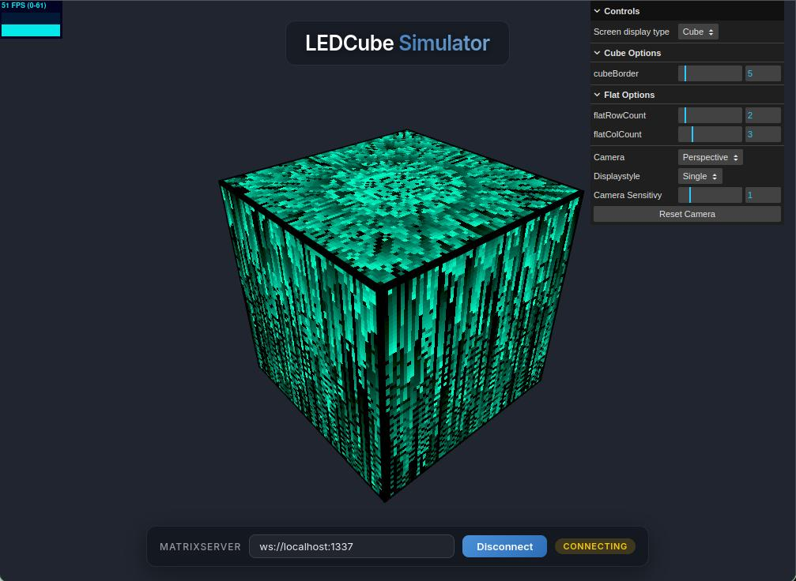

[](https://github.com/bjoernh/matrixserver/actions/workflows/docker-build-push.yml)
[](https://github.com/bjoernh/matrixserver/actions/workflows/docker-build-push-rpi.yml)

# LEDCube matrixserver

This is a screenserver for the purpose of being used with differently orientated LED Matrix panels. 
It currently has been implemented for the LEDCube project, but it can also be used in simple, 
planar screen orientations, as well as other complex screen orientations.

# Quick Start: All-in-One Simulator Container

The easiest way to get started is using the **self-contained simulator Docker image**, which bundles:

- The `matrix_server_simulator` binary
- The **CubeWebapp** web frontend (built into the image)
- An **Nginx HTTPS reverse proxy** that serves the webapp UI and proxies the WebSocket connection

This means you only need a single container to run the server and access the 3D cube simulator from any browser — no separate processes, no external URLs.

## Using Docker Compose (Recommended)

The repository includes a `docker-compose.yml` for a one-command startup:

```bash
# Pull and start the simulator container
docker compose up
```

Or to run it in the background:

```bash
docker compose up -d
```

Once running, open your browser and navigate to:

```
https://localhost:5173
```

> **Note:** The container uses a self-signed TLS certificate generated at build time. Your browser will show a security warning — this is expected. Accept the exception to proceed (in Chrome: click *Advanced → Proceed to localhost*; in Firefox: click *Accept the Risk and Continue*).

The CubeWebapp will load automatically. To connect it to the matrix server:

1. In the CubeWebapp UI, set the WebSocket address to:
   ```
   wss://localhost:5173/matrix-ws
   ```
2. Click **Connect**
3. Start a Matrix Application (e.g., from the `exampleApplications` repository) — the server address is `localhost:2017`

### Dynamic Parameter Configuration
The CubeWebapp features a **Parameter Configuration Panel** (collapsible sidebar via ⚙ icon) that allows you to:
- Adjust animation parameters in real-time (speed, spawn rate, colors, modes, etc.)
- The available controls are dynamically generated based on the schema provided by the running application.
- Save and load **Presets** as JSON files to persist your favorite settings.



### Exposed Ports

| Port | Protocol | Description |
|------|----------|-------------|
| `2017` | TCP | Matrix Server — client applications connect here |
| `1337` | TCP/WS | WebSocket Simulator Renderer — raw WebSocket endpoint |
| `5173` | HTTPS | Nginx — serves the CubeWebapp UI and proxies `/matrix-ws` over TLS |

> **Tip for mobile / remote access:** Because the browser-side WebSocket is proxied through Nginx over HTTPS/WSS on port `5173`, you can also access the simulator from other devices on your network by replacing `localhost` with your machine's local IP address (e.g., `https://192.168.1.42:5173`). Modern browsers require HTTPS to allow WebSocket connections from a web page, which is why TLS is used even locally.

## Using Docker Run (without Compose)

```bash
docker run -it --rm \
  -p 2017:2017 \
  -p 1337:1337 \
  -p 5173:5173 \
  ghcr.io/bjoernh/matrixserver-simulator:latest
```

## How it Works (Architecture)

```
Browser (https://localhost:5173)
    │
    │  HTTPS (port 5173)
    ▼
  Nginx (inside container)
    │                │
    │ /CubeWebapp/ │  /matrix-ws  (WSS proxy)
    ▼             ▼
  Static UI    ws://localhost:1337
                      │
                      ▼
          matrix_server_simulator
                      │
                      ▼  (port 2017, TCP)
              Matrix Applications
```

The container runs two processes:
1. **Nginx** on HTTPS port `5173`: serves the CubeWebapp static web app and proxies WebSocket connections from `/matrix-ws` to the internal raw WebSocket on port `1337`.
2. **matrix_server_simulator**: the matrix server, listening on TCP `2017` for Matrix Application clients and on WebSocket `1337` for simulator renderer connections.

## Simulator Configuration

The `simulator_config.json` file at the repository root configures the 6-sided cube layout (64×64 per face). You can mount a custom config into the container if needed:

```bash
docker run -it --rm \
  -p 2017:2017 -p 1337:1337 -p 5173:5173 \
  -v $(pwd)/simulator_config.json:/app/matrixServerConfig.json \
  ghcr.io/bjoernh/matrixserver-simulator:latest \
  matrix_server_simulator --config /app/matrixServerConfig.json
```

---

# Dependencies

on raspbian and ubuntu:
`sudo apt install git libeigen3-dev cmake wiringpi libboost-all-dev libasound2-dev libprotobuf-dev protobuf-compiler libimlib2-dev`

# Building from Source

**Make sure you have cloned with submodules** `git clone --recursive`  
Tested on Ubuntu, Raspbian & macOS.

The `CubeWebapp` is included as a git submodule under `CubeWebapp/`. It is built as part of the simulator and RPi Docker images.

By default, on macOS and standard Ubuntu setups, only the simulator target is built.

To build the project for a standard development environment (simulator only):
```bash
mkdir build && cd build && cmake .. && make
```

To build for a specific hardware backend, set `-DHARDWARE_BACKEND`:
```bash
# FPGA via FTDI USB (IceBreaker board)
mkdir build && cd build && cmake -DHARDWARE_BACKEND=FPGA_FTDI .. && make

# FPGA via Raspberry Pi SPI
mkdir build && cd build && cmake -DHARDWARE_BACKEND=FPGA_RPISPI .. && make

# RGB Matrix panels via Raspberry Pi GPIO
mkdir build && cd build && cmake -DHARDWARE_BACKEND=RGB_MATRIX .. && make
```

Valid values for `HARDWARE_BACKEND`: `FPGA_FTDI`, `FPGA_RPISPI`, `RGB_MATRIX`

When `HARDWARE_BACKEND` is set, two targets are built:
- `matrix_server_simulator` — always built for development/testing
- `matrix_server` — hardware server with the selected renderer

To build and install the project to a local directory (e.g., `./install`):
```bash
mkdir -p build && cd build
cmake -DCMAKE_INSTALL_PREFIX=$(pwd)/../install ..
make -j$(nproc)
make install
```

# Releases and Docker

Pre-built binaries and Docker images are automatically generated for every repository tag.

## Debian Packages
Pre-compiled `.deb` packages for both `amd64` (Simulator targets) and `arm64` (Raspberry Pi hardware targets) are available on the [GitHub Releases](https://github.com/bjoernh/matrixserver/releases) page. You can easily install them on compatible systems using:
`sudo dpkg -i matrixserver-*.deb`

## Docker Images

Pre-built images are hosted on the GitHub Container Registry (GHCR).

**Simulator (AMD64)**
```bash
docker pull ghcr.io/bjoernh/matrixserver-simulator:latest
```

See the [Quick Start](#quick-start-all-in-one-simulator-container) section above for usage.

**Raspberry Pi (ARM64)**
```bash
docker pull ghcr.io/bjoernh/matrixserver-rpi:latest
# Hardware access usually requires privileges or mapping specific /dev devices
docker run -it --rm --privileged -v /dev:/dev ghcr.io/bjoernh/matrixserver-rpi:latest matrix_server
```
*(Note: You can pass any of the standard server parameters, such as `--config`, at the end of the `docker run` command).*

# Server Configuration

Both server targets share a unified command-line interface:

*   **`-h, --help`**: Display available command-line options.
*   **`--config <path>`**: Path to the `matrixServerConfig.json` configuration file. If not provided, the server checks the current directory or prompts you to generate a default one.
*   **`--address <ip>`**: Override the server address specified in the configuration file.

When starting a server without an existing configuration file, it will explicitly prompt you `[y/N]` before creating a default `matrixServerConfig.json` in the current directory. If you decline, it runs with a default in-memory configuration.

The generated config includes per-screen `screenRotation`, `offsetX`, `offsetY` fields that specify how each cube face maps to physical display positions. These defaults are set correctly for the selected hardware backend and can be adjusted in the JSON file.

## IMU Orientation Configuration
To align a mounted orientation of the IMU sensor with the software, rotation to the gravity vector can be applied.

Applications using the MPU6050 IMU sensor (Raspberry Pi only) read orientation corrections from `matrixServerConfig.json`:

```json
{
  "imuOrientation": {
    "xyRotationDeg": 0.0,
    "xzRotationDeg": 45.0,
    "yzRotationDeg": 0.0
  }
}
```

The three rotation angles compensate for how the sensor is physically mounted:
- `xyRotationDeg`: Rotation around the Z axis
- `xzRotationDeg`: Rotation around the Y axis
- `yzRotationDeg`: Rotation around the X axis

All values default to 0° when omitted, ensuring backwards compatibility with existing configurations.

# Important: Running an Application

The matrix server only acts as a display driver. By itself, it will only maintain the connection and show a blank screen or default background. 

To actually see something rendered on your led matrix or the simulator, **you must start a client application** after the server is running. The client application connects to the matrix server and sends the actual pixel data to be displayed. 

You can find example applications to run in the `exampleApplications` repository (e.g., `cubetestapp` or `PixelFlow3`).

# Example: Running the server on a Raspberry Pi with an IceBreaker board

If you have an IceBreaker board with HUB75 PMOD:  
* at first load the FPGA with the `rgb_panel` project example (https://github.com/squarewavedot/ice40-playground/tree/master/projects/rgb_panel)   
* hook up the IceBreaker to the Raspberry Pi via USB
* build and start the hardware server: `cmake -DHARDWARE_BACKEND=FPGA_FTDI .. && make && ./server_hardware/matrix_server`
* In another terminal compile and start the `cubetestapp` or `PixelFlow` or any other target from the exampleApplications repository.


## Repository Structure & Modules

The project is divided into logical directories that separate the server daemon, the display rendering technologies, the shared communication protocols, and client application libraries:

*   **`common`**
    *   Defines the core `matrixserver` Protobuf messages used for exchanging pixel data and configurations between clients and the server.
    *   Contains the underlying connection implementations (IPC using Boost Message Queues for local performance, Unix Sockets, TCP Sockets for network streams).
    *   Provides foundational classes like `Screen`, `Color`, and `Cobs` encoding.

*   **`renderer`**
    *   Contains interchangeable rendering backends that the server uses to output the final pixel buffers to physical or virtual displays.
    *   *Supported Renderers include:*
        *   **`RGBMatrixRenderer`**: Hardware interface driving HUB75 panels directly from Raspberry Pi GPIOs (via `rpi-rgb-led-matrix`).
        *   **`WebSocketSimulatorRenderer`**: Network interface for the web-based `CubeWebapp`. Supports a `streamPixels` flag (default `true`): when `false`, pixel streaming is disabled and the renderer acts as a pure bidirectional control channel (parameter schema + value exchange only).
        *   **`FPGAFTDIRenderer` & `FPGASPIRenderer`**: Protocol implementations for sending pixel data to an IceBreaker FPGA board acting as the HUB75 driver, via USB FTDI or RPi SPI.

*   **`server`**
    *   The core daemon logic containing the `Server` class that accepts connections, validates configuration parameters, and routes incoming application frames to the active renderers.
    *   Includes a unified `ServerSetup` utility to handle configuration parsing, screen orientation defaults, and hardware-specific config generation.

*   **`application`**
    *   A client-side C++ library containing base classes like `MatrixApplication` and `CubeApplication`. 
    *   These provide a high-level API with convenient drawing methods (e.g., `setPixel3D`, coordinate mapping) for writing custom programs that connect to the screen server.

*   **`server_simulator/`** and **`server_hardware/`** (The Executables)
    *   **`server_simulator`**: Always built. Produces `matrix_server_simulator`, which uses `WebSocketSimulatorRenderer` to interact with the web simulator.
    *   **`server_hardware`**: Built when `-DHARDWARE_BACKEND=<value>` is set. Produces `matrix_server`, compiled with the selected hardware renderer. The renderer is selected at compile time via preprocessor defines. In addition to the hardware renderer, a `WebSocketSimulatorRenderer` (with `streamPixels=false`) is registered as a second renderer so the CubeWebapp can connect on WebSocket port `1337` for runtime parameter control — without any pixel streaming overhead.

*   **`MainMenu`**
    *   A built-in example client application that provides a launch interface for the cube.
    *   Scans a directory for executable applications and lets the user browse and launch them via joystick.
    *   The search directory is configured via the `CUBE_APP_PATH` environment variable. If unset, it defaults to `$HOME/APPS`.

*   **`CubeWebapp`** *(git submodule)*
    *   The web-based 3D LED cube simulator and configuration interface, included as a submodule from `git@github.com:bjoernh/CubeWebapp.git`.
    *   Built automatically as part of the Docker images. The compiled static web app is served by Nginx inside the container.
